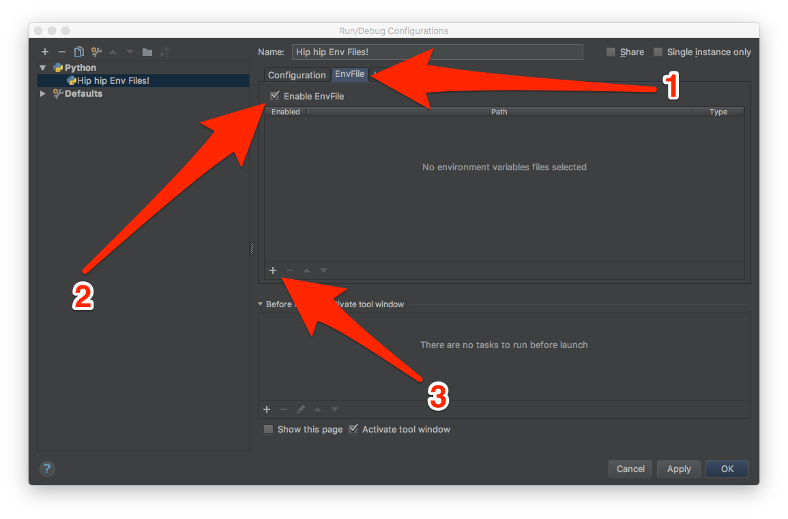

# EnvFile

## Description

**Env File** is a plugin for JetBrains IDEs that allows you to set environment variables for your run configurations 
from one or multiple files.

## Version 2.0 Notice

Please notice that `EnvFile` just received a major upgrade and was released as a new major version - `v2.0`.
With the main goal of major update being support for more JetBrains platforms a lot of things changed, including UI,
so please be sure to read the updated guide below, even if you already have used previous versions of `EnvFile`.

### Supported Formats

- **.env**
- **YAML** dictionary
- **JSON** dictionary *(parsed with YAML parser since [JSON is subset of YAML][json-is-yaml])*

**All formats assume that both keys and values are strings.**

### Supported Platforms

<em>
Expand to see supported run configuration types. Italic means that run configuration is only available in paid
version of the product.
</em>
<br/>
<br/>
<details>
    <summary><strong>PyCharm</strong></summary>
    <ul>
        <li><em>App Engine server</em></li>
        <li><em>Behave</em></li>
        <li><em>Django server</em></li>
        <li><em>Django tests</em></li>
        <li>Lettuce</li>
        <li>Pyramid server</li>
        <li>Python</li>
        <li>
            Python docs
            <ul>
                <li>Docutils task</li>
                <li>Sphinx task</li>
            </ul>
        </li>
        <li>
            Python test
            <ul>
                <li>Unittests</li>
                <li>Doctests</li>
                <li>Nosetests</li>
                <li>py.test</li>
                <li>Attests</li>
            </ul>
        </li>        
        <li>Tox</li>
    </ul>
</details>

<details>
    <summary><strong>IDEA</strong></summary>
    <ul>
        <li>Application</li>
        <li><em>Arquillian JUnit</em></li>
        <li><em>Arquillian TestNG</em></li>
        <li><em>CloudBees Server</em></li>
        <li><em>Cucumber Java</em></li>
        <li><em>GWT Configuration</em></li>
        <li>
            <em>Geronimo Server<em/>
            <ul>
                <li><em>Local</em></li>
                <li><em>Remote</em></li>
            </ul>
        </li>
        <li>
            <em>GlassFish Server</em>
            <ul>
                <li><em>Local</em></li>
                <li><em>Remote</em></li>
            </ul>
        </li>        
        <li><em>Google AppEngine Dev Server</em></li>
        <li><em>Grails</em></li>
        <li>JAR Application</li>
        <li>
            <em>JBoss Server</em>
            <ul>
                <li><em>Local</em></li>
                <li><em>Remote</em></li>
            </ul>
        </li>
        <li>
            <em>JSR45 Compatible Server</em>
            <ul>
                <li><em>Local</em></li>
                <li><em>Remote</em></li>
            </ul>
        </li>
        <li>
            <em>Jetty Server</em>
            <ul>
                <li><em>Local</em></li>
                <li><em>Remote</em></li>
            </ul>
        </li>
        <li>JUnit</li>
        <li>Kotlin</li>
        <li>Kotlin script</li>
        <li>
            <em>Resin</em>
            <ul>
                <li><em>Local</em></li>
                <li><em>Remote</em></li>
            </ul>
        </li>
        <li><em>Spring Boot</em></li>
        <li>
            <em>Spring dmServer</em>
            <ul>
                <li><em>Spring dmServer (Local)</em></li>
                <li><em>Spring dmServer (Remote)</em></li>
            </ul>
        </li>
        <li>TestNG</li>
        <li>
            <em>TomEE Server</em>
            <ul>
                <li><em>Local</em></li>
                <li><em>Remote</em></li>
            </ul>
        </li>
        <li>
            <em>TomCat Server</em>
            <ul>
                <li><em>Local</em></li>
                <li><em>Remote</em></li>
            </ul>
        </li>
        <li>
            <em>WebLogic Server</em>
            <ul>
                <li><em>Local</em></li>
                <li><em>Remote</em></li>
            </ul>
        </li>
        <li>
            <em>WebSphere Server</em>
            <ul>
                <li><em>Local</em></li>
                <li><em>Remote</em></li>
            </ul>
        </li>
    </ul>
</details>
  
<details>
    <summary><strong>RubyMine</strong></summary>
        <ul>
            <li>Capistrano</li>
            <li>Cucumber</li>
            <li>Gem Command</li>
            <li>IRB Console</li>
            <li>RSpec</li>
            <li>Rack</li>
            <li>Rails</li>
            <li>Rake</li>
            <li>Ruby</li>
            <li>Spork DRb</li>
            <li>Test::Unit/Shoulda/Minitest</li>
            <li>Zeus Server</li>  
        </ul>
</details>

## Installation

- Using IDE built-in plugin system:
  - <kbd>Preferences</kbd> > <kbd>Plugins</kbd> > <kbd>Browse repositories...</kbd> > <kbd>Search for "Env File"</kbd> > <kbd>Install Plugin</kbd>
  
- Manually:
  - Download the [latest release][latest-release] and install it manually using <kbd>Preferences</kbd> > 
  <kbd>Plugins</kbd> > <kbd>Install plugin from disk...</kbd>
  
Restart IDE.

## Usage

- Add new *Run/Debug configuration*: <kbd>+</kbd> <kbd>Add new configuration</kbd> > <kbd>...</kbd>
- Switch to <kbd>EnvFile</kbd> tab
- Enable <kbd>EnvFile</kbd> checkbox
- Click on <kbd>+</kbd> to add a file



### Examples

#### .env

```ini
# This line is ignored since it's a comment
SECRET_KEY=hip-hip-env-files
VERSION=1.0
```

or 

```ini
# This line is ignored since it's a comment
SECRET_KEY hip-hip-env-files
VERSION 1.0
```

#### JSON

```yaml
{
    # JSON doesn't have comments but since JSON is subset of YAML
    # We parse it with YAML parser and therefore have comments
    # And even trialling commas in objects :)
    "SECRET_KEY": "hip-hip-env-files",
    "VERSION": "1.0", # All non-string literals should be enclosed in quotes; btw this is ignored too
}
```
    
#### YAML

```yaml
# This line is ignored since it's a comment
SECRET_KEY: hip-hip-env-files
VERSION: "1.0" # All non-string literals should be enclosed in quotes; btw this is ignored too 
```

#### Bash (workaround)

There was a number of requests to support extracting environment variables from bash scripts like:
 
```bash
export SECRET_KEY="hip-hip-env-files"
export VERSION="1.0"
```

The feasible way to do that is yet to be discovered (if any at all) so the plugin does not support that at the moment.
On the other hand there is a simple workaround that can be used for the time being. The example bash script from above
can be split into an `.env` file and a generic script that can be used to set environment variables on a command line:

**.env**
```ini
SECRET_KEY="hip-hip-env-files"
VERSION="1.0"
```

**set-env.sh**
```bash
while read -r line; do export $line; done < .env
```
**usage**
```
$ . set-env.sh
$ echo $VERSION
1.0
```

# Further Development

- Add more formats (upon requests)
- Add support for other JetBrains products/plugins (upon requests)
- Add environment variables expansion (feasible?)
- Add unit tests (¯\\\_(ツ)_/¯)

# Feedback

Any feedback, bug reports and feature requests are highly appreciated!

Feel free to create an issue, contact me using `Github` or just drop me an email to the address specified in 
[plugin.xml](./META-INF/plugin.xml)`/idea-plugin/vendor@email`. 

# License

Copyright (c) 2017 Borys Pierov. See the [LICENSE](./LICENSE) file for license rights and limitations (MIT).

[json-is-yaml]:           https://en.wikipedia.org/wiki/YAML#JSON
[latest-release]:         https://github.com/Ashald/EnvFile/releases/latest
